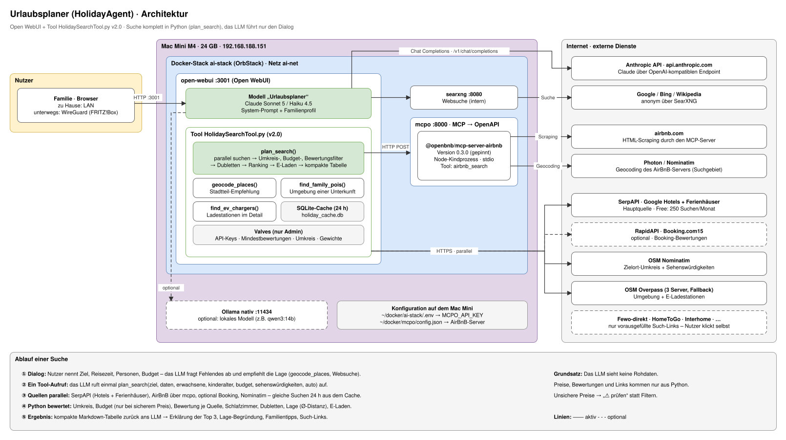

# HolidayAgent – Familien-Urlaubsplaner

Ein Agent in Open WebUI (Mac Mini M4, `ai-stack`), der für die Familie Unterkünfte sucht, bewertet und Urlaubstipps gibt. Die Anforderungen stehen in [UseCases](UseCases).

---

## Architektur

**Grundprinzip:** Die gesamte Suche läuft in **einem** Tool-Aufruf (`plan_search`) in Python. Das LLM führt nur den Dialog und erklärt das Ergebnis. Preise, Bewertungen und Links gehen nie durch das Modell, das sie verändern oder erfinden könnte. Das spart auch Tokens.



> Quelle: [Architektur.drawio.svg](Architektur.drawio.svg). Bearbeiten in VS Code mit der Extension **Draw.io Integration** (`hediet.vscode-drawio`).

| Quelle | Weg | Kosten | Liefert |
|---|---|---|---|
| Google Hotels | SerpAPI `google_hotels` | Free: 250 Suchen/Monat | Hotels inkl. Angebote von Booking, Expedia, Direktbuchung; Gesamtpreis inkl. Steuern |
| Google Ferienhäuser | SerpAPI `google_hotels` + `vacation_rentals=true` | gleiches Kontingent | Ferienwohnungen/-häuser (Vrbo u.a.), Schlafzimmer |
| AirBnB | MCP-Server über mcpo (Scraping), aus Python aufgerufen | kostenlos | Listings, Gesamtpreis, Bewertung, Schlafzimmer, Koordinaten |
| Booking.com (optional) | RapidAPI „Booking.com“ (booking-com15) | Free-Tier (klein) | 10er-Bewertung; Booking-Angebote sind großteils schon in Google Hotels enthalten |
| Fewo-direkt, HomeToGo, Interhome | Deep-Links | kostenlos | vorausgefüllte Suche zum Selbstklicken |
| Lage & Umgebung, E-Laden | OpenStreetMap (Nominatim, Overpass) | kostenlos | Koordinaten, POIs, Ladestationen |

> Eine `plan_search` verbraucht **2 SerpAPI-Anfragen** (Hotels + Ferienhäuser), also ca. 125 Suchen/Monat im Free-Tier. Mit Booking-Key kommen **2 RapidAPI-Anfragen** dazu. Gleiche Suchen werden 24 h lang aus dem SQLite-Cache bedient (`/app/backend/data/holiday_cache.db`).

> **AirBnB:** Es gibt keine offizielle API; der MCP-Server liest die Webseite aus. Das bewegt sich in einer Grauzone der AirBnB-AGB und ist nur für private Nutzung mit wenigen Anfragen gedacht. Die Version ist in [mcpo-config.json](mcpo-config.json) gepinnt (`0.3.0`), damit sich das Ausgabeformat nicht unbemerkt ändert. Updates bewusst einspielen und danach den Test-Schritt „AirBnB“ wiederholen.

---

## Ranking

**Harte Filter** (Valves):

| Kriterium | Regel |
|---|---|
| Umkreis | weiter als `max_distance_km` (15 km) vom Zielort → raus. Bei großen Zielen (Region, Insel) wächst der Umkreis mit der Ortsgröße laut OpenStreetMap (z.B. Mallorca ≈ 62 km). Ist der Zielort zu unscharf (z.B. „Ostsee“ = Punkt im Meer), wird der Filter automatisch ausgesetzt und das im Ergebnis vermerkt |
| Verfügbarkeit | kein Preis → gilt als nicht verfügbar |
| Budget | Gesamtpreis > Budget → raus, **aber nur bei sicherem Preis** (siehe unten) |
| Bewertung | **je Quelle eigene Schwelle**: Google ≥ 4,3/5, Booking ≥ 8,5/10, AirBnB ≥ 4,8/5 (AirBnB-Median liegt bei ≈ 4,8) |
| Anzahl Bewertungen | ≥ `min_reviews` (20) |
| Schlafzimmer | ≥ 2 bei Kindern (Studio = 1) – nur wenn bekannt, sonst „prüfen“ |

**Unsichere Preise** werden nicht gefiltert, sondern mit „⚠️ prüfen“ markiert und im Preis-Score neutral bewertet:
- fremde Währung (AirBnB wählt die Währung selbst, der MCP-Server kann sie nicht vorgeben)
- AirBnB zeigt nur einen Preis pro Nacht → auf den Aufenthalt hochgerechnet

Preishinweise wie „zzgl. Steuern“ oder „ggf. zzgl. Kurtaxe“ stehen unter der Tabelle. Alle Quellen erhalten Anzahl und Alter der Kinder (AirBnB: unter 2 Jahren als Kleinkind), damit für die ganze Familie bepreist wird.

**Score (0–100):**

| Kriterium | Gewicht | Berechnung |
|---|---|---|
| Bewertung | 35 % | linear zwischen der Mindestbewertung **der jeweiligen Quelle** und dem Skalenmaximum |
| Anzahl Bewertungen | 20 % | logarithmisch, 500+ = volle Punkte |
| Lage | 25 % | **mittlere Distanz zu allen Sehenswürdigkeiten**; die bestgelegene Unterkunft = volle Punkte, `location_tolerance_km` (4 km) schlechter = 0; ohne Sehenswürdigkeiten neutral |
| Preis | 20 % | ≤ 50 % des Budgets = volle Punkte; unsicherer Preis = neutral |

**Dubletten:** Gleicher Name (Akzente ignoriert) oder < 150 m Abstand mit ähnlichem Namen → das günstigste sichere Angebot bleibt, die anderen Portale stehen als „auch: …“ dabei.

**E-Laden (bei `travel_by_car=true`):** Spalte „E-Laden“ mit nächster öffentlicher Ladestation (≤ 1,5 km, `ev_radius_m`) und nächstem Schnelllader ≥ 50 kW (≤ 5 km, `ev_fast_radius_m`). Nennt das Portal eine Ladestation in der Ausstattung, erscheint „⚡ an Unterkunft laut Portal“. Eine Overpass-Abfrage für alle Top-Treffer. Nur Information, **nicht im Score**.

---

## Einrichtung

### 1. API-Keys besorgen

| Dienst | Wo | Hinweis |
|---|---|---|
| Anthropic | console.anthropic.com → API Keys | unter *Billing → Limits* ein monatliches Spend-Limit setzen (z.B. 10 €) |
| SerpAPI | serpapi.com → Registrieren → Dashboard | Free-Plan (250 Suchen/Monat) |
| RapidAPI (optional) | rapidapi.com → API „Booking.com“ von DataCrawler (`booking-com15`) → Basic-Plan | nur wenn Booking-Bewertungen zusätzlich gewünscht |

Keys **nicht** ins Repo – sie kommen in die `.env` auf dem Mac Mini bzw. in die Tool-Valves.

### 2. Claude in Open WebUI anbinden

**Admin-Panel → Einstellungen → Verbindungen → OpenAI-API → +**

| Feld | Wert |
|---|---|
| URL | `https://api.anthropic.com/v1` |
| Key | Anthropic API-Key |
| API Typ | **Chat Completions** (nicht „Responses“ – Anthropic hat keinen `/v1/responses`-Endpoint → Fehler „Not Found“) |
| Model IDs | `claude-sonnet-5` (optional `claude-haiku-4-5-20251001` zum Testen, siehe unten) |

> **Einschränkung:** Anthropic beschreibt den OpenAI-kompatiblen Endpoint als *„primarily intended to test and compare model capabilities“*. Prompt-Caching und `strict` bei Tools werden nicht unterstützt ([Doku](https://platform.claude.com/docs/en/api/openai-sdk)). Tool-Calling funktioniert vollständig. Da `plan_search` nur 1–2 Tool-Runden braucht, ist der Kostennachteil ohne Caching gering. Falls Anthropic den Endpoint einschränkt: Umstieg auf eine native Anthropic-Anbindung (Open-WebUI-Pipe-Funktion oder LiteLLM).

> Die Verbindung wird in der Open-WebUI-Datenbank gespeichert. Die Env-Variablen `OPENAI_API_*` im Compose gelten nur beim allerersten Start – deshalb über die UI konfigurieren.

### 3. mcpo + AirBnB starten

Siehe [ai-stack.md](../ContainerStack/Readme/ai-stack.md#docker-composeyml) – Service `mcpo`.

```bash
ssh davidmarotzke@192.168.188.151
mkdir -p ~/docker/mcpo
# mcpo-config.json aus diesem Ordner nach ~/docker/mcpo/config.json kopieren
# MCPO_API_KEY in ~/docker/ai-stack/.env eintragen (z.B. openssl rand -hex 24)
docker compose -f ~/docker/ai-stack/docker-compose.yml up -d mcpo
docker logs -f mcpo        # beim ersten Start lädt npx den AirBnB-Server
```

mcpo muss **nicht** als Tool-Server in Open WebUI eingetragen werden: `plan_search` ruft AirBnB direkt über `http://mcpo:8000/airbnb/airbnb_search` auf. So kann das LLM die AirBnB-Rohdaten gar nicht erst sehen oder abschreiben.

### 4. Tool anlegen

**Arbeitsbereich → Tools → + Neu** → Inhalt von [HolidaySearchTool.py](HolidaySearchTool.py) einfügen → speichern.
Danach **Valves** (Zahnrad) öffnen:

| Valve | Wert |
|---|---|
| `serpapi_key` | **Pflicht:** SerpAPI-Key |
| `mcpo_api_key` | **Pflicht:** Wert von `MCPO_API_KEY` aus `~/docker/ai-stack/.env` |
| `rapidapi_key` | optional, leer = Booking wird übersprungen |
| `mcpo_url` | Standard `http://mcpo:8000` passt (gleiches Docker-Netz `ai-net`) |
| `nominatim_user_agent` | Standard passt. Die OSM-Regeln verlangen nur einen App-Namen statt des Bibliotheks-Standards; eine Kontakt-Mail ist freiwillig |

Alle übrigen Valves (Filter, Schwellen, Gewichte) haben sinnvolle Standardwerte.

### 5. Modell „Urlaubsplaner“ anlegen

**Arbeitsbereich → Modelle → + Neu**

| Einstellung | Wert |
|---|---|
| Name | Urlaubsplaner |
| Basismodell | `claude-sonnet-5` |
| System-Prompt | [system-prompt.md](system-prompt.md) mit eingefügtem [family-profile.md](family-profile.md) (Platzhalter vorher ausfüllen) |
| Tools | nur „Urlaubsplaner – Unterkunftssuche“ |
| Fähigkeiten | Websuche ✅ |
| Erweiterte Parameter → Function Calling | **Native** |
| Sichtbarkeit | Gruppe „Familie“ |

### 6. Familie freischalten

1. **Admin-Panel → Benutzer** → Accounts für die Familie anlegen.
2. **Admin-Panel → Benutzer → Gruppen** → Gruppe „Familie“ anlegen, Accounts hinzufügen.
3. Modell „Urlaubsplaner“ und das Tool für die Gruppe freigeben (Lese-/Nutzungszugriff).
4. **Berechtigungen der Gruppe prüfen: Workspace → Tools / Functions / Models müssen AUS sein.**

> ⚠️ **Sicherheit:** Open-WebUI-Tools führen beliebigen Python-Code im Open-WebUI-Container aus – mit Zugriff auf Datenbank, alle Chats und alle hinterlegten Keys. Laut [Open-WebUI-Doku](https://docs.openwebui.com/features/extensibility/plugin/tools/) ist das Recht, Tools anzulegen, *„root-equivalent“*. Es ist für Nicht-Admins standardmäßig aus und darf der Familie-Gruppe nicht gegeben werden. Die API-Keys in den Valves sind für normale Nutzer nicht sichtbar.

Von unterwegs erreichbar über WireGuard → `http://192.168.188.151:3001`.

### 7. Eigenes Reise-Wissen einbinden (optional)

Nach dem ersten Urlaub kannst du ein Wissen mit bisherigen Hotels und Erfahrungen anlegen. Der Agent nutzt das dann, um schneller hilfreiche Vorschläge zu machen.

1. **Datei vorbereiten:** Vorlage [Reise-Wissen-Vorlage.md](Reise-Wissen-Vorlage.md) öffnen, die Beispiel-Einträge durch eure bisherigen Reisen ersetzen (einfach neue `##`-Überschriften mit Ort + Datum oben hinzufügen).

2. **In Open WebUI:**
   - **Arbeitsbereich → Wissen → + Sammlung anlegen** → Name „Urlaubsplaner-Wissen"
   - **Dateien hinzufügen** → die angepasste Datei hochladen
   - Das Wissen ist jetzt verfügbar, sobald die Datei verarbeitet ist (kurz warten)

3. **An das Modell „Urlaubsplaner" anhängen:**
   - Modell bearbeiten → **Wissen hinzufügen** → „Urlaubsplaner-Wissen" auswählen
   - **Modus:** „Full Context" (für wenige / kurze Dateien das Zuverlässigste; alles wird bei jeder Anfrage mitgegeben)
   - Speichern

4. **Nach einer neuen Reise:** Einfach einen neuen Eintrag am Anfang der Datei hinzufügen und die Datei in Open WebUI erneut hochladen (alte wird ersetzt). Der Agent wird dann beim nächsten Mal zum gleichen Ziel nach dieser Erfahrung fragen.

---

## Test-Checkliste

1. Modell-Dropdown zeigt `claude-sonnet-5`, einfacher Chat funktioniert.
2. **AirBnB/mcpo:**
   ```bash
   docker exec open-webui curl -s -X POST http://mcpo:8000/airbnb/airbnb_search \
     -H "Authorization: Bearer $MCPO_API_KEY" -H "Content-Type: application/json" \
     -d '{"location":"Lissabon","checkin":"2026-10-12","checkout":"2026-10-19","adults":2,"children":2,"propertyType":"entire_home"}' | head -c 1500
   ```
   Die Antwort muss `searchResults` enthalten, jeweils mit `avgRatingA11yLabel` und `structuredDisplayPrice`. Achte darauf, in welcher Währung die Preise kommen.
3. Im Chat: *„Lissabon, 12.–19.10.2026, 2 Erwachsene + 2 Kinder (5, 8), Budget 2.000 €, wir wollen nach Belém, in die Alfama und ins Oceanário.“* Erwartet:
   - Rückfrage zur Anreise, danach eine Stadtteil-Empfehlung
   - **ein** `plan_search`-Aufruf
   - Tabelle mit Treffern aus ≥ 3 Quellen; die „Quellen“-Zeile zeigt alle als erfolgreich
   - Links funktionieren, und Preise stimmen stichprobenartig mit dem Portal überein
4. *„Ostsee, 1 Woche im Juli, mit dem Auto“* → Strand- und Parkplatznähe in der Begründung, Spalte „E-Laden“ mit Schnelllader-Info.
5. `serpapi_key` in den Valves leeren → Agent antwortet mit AirBnB (+ Booking) und nennt den Ausfall.
6. Mit einem Familien-Account einloggen → Urlaubsplaner nutzbar, kein Zugriff auf Arbeitsbereich/Tools/Valves.
7. Nach einer Woche Verbrauch in SerpAPI- und Anthropic-Dashboard prüfen.
8. **Ortsnamen mit Land:** *„Römö in Dänemark, 12.–19.10.2026, 2 Erwachsene“* → Treffer liegen auf Rømø (Dänemark), keine aus Rom. Ohne Landesangabe fragt der Agent nach dem Land. Zur Kontrolle direkt gegen mcpo: `"location":"Römö, Dänemark"` muss Koordinaten um 55,1 N / 8,5 O liefern.
9. Optional: dasselbe Szenario mit `claude-haiku-4-5-20251001` bzw. einem lokalen Modell (z.B. `qwen3:14b`) als Basismodell. Da die Logik im Tool steckt, reicht evtl. ein kleineres Modell; Qualität der Tipps und Dialogführung vergleichen.

---

## Kosten

| Posten | Kosten |
|---|---|
| Claude Sonnet 5 ($2 / $10 pro Mio. Input/Output-Tokens) | geschätzt ca. 0,05–0,20 € pro kompletter Urlaubssuche inkl. Dialog (1–2 Tool-Runden, kompaktes Tool-Ergebnis) – **nicht gemessen**, nach dem ersten Test im Anthropic-Dashboard prüfen |
| Claude Haiku 4.5 ($1 / $5) | etwa die Hälfte |
| SerpAPI | Free-Tier (250 Suchen/Monat) |
| RapidAPI (optional) | Free-Tier |
| OpenStreetMap, SearXNG, AirBnB-MCP | kostenlos |
| **Fixkosten** | **0 €** |

---

## Bekannte Grenzen

| Thema | Details |
|---|---|
| AirBnB-Währung | Der MCP-Server fragt airbnb.com ab und kann keine Währung vorgeben. Kommt nicht EUR zurück, steht „⚠️ prüfen“ am Preis; es wird bewusst nicht umgerechnet |
| AirBnB-Format | Scraping: Ändert AirBnB die Seite, liefert die Quelle Fehler. Sie wird dann in der „Quellen“-Zeile als Fehler angezeigt, die anderen Quellen laufen weiter |
| Preise inkl. Nebenkosten | Google: inkl. Steuern und Gebühren. Booking: separat ausgewiesene Steuern werden addiert, sonst „ggf. zzgl. Kurtaxe“. AirBnB: Gesamtpreis laut Suchergebnis (inkl. Gebühren); „zzgl. Steuern“, wenn AirBnB das angibt |
| Schlafzimmer bei Hotels | Google Hotels und Booking liefern die Zimmeraufteilung meist nicht → „prüfen“, kein Ausschluss |
| Booking-Links | Die API liefert keine direkte Hotel-URL → Link öffnet die Booking-Suche nach dem Hotelnamen mit Reisedaten |
| Lage | Luftlinie, keine ÖPNV-Fahrzeit. Bei weit verteilten Zielen weist `geocode_places` darauf hin |
| AirBnB-Suchgebiet | Der AirBnB-Server vergrößert das Suchgebiet stark (bei „Lissabon“ bis ca. 100 km). Der Umkreisfilter fängt das ab; Orte innerhalb von 15 km (z.B. Costa da Caparica) bleiben drin und werden nur über die Lage-Bewertung abgestuft, wenn Sehenswürdigkeiten angegeben sind |
| Ortsnamen / Land | `plan_search` verlangt das Land (`country`) und hängt es an jede Suchanfrage („Römö, Dänemark“). Ohne Land werden Ortsnamen falsch aufgelöst (Römö → Rom). Liegt kein Treffer einer Quelle im Umkreis des Zielorts (OSM-Geocoding), wird die Quelle verworfen und in der „Quellen“-Zeile als „verworfen“ angezeigt |
| Deep-Links | Fewo-direkt, HomeToGo und Interhome übernehmen nicht immer alle Filter |
| E-Ladestationen | OSM-Daten sind in DE/EU gut, aber nicht vollständig. Die Ladeleistung ist oft nicht erfasst („Stecker unbekannt“), Hotel-Wallboxen fehlen häufig, keine Live-Belegung |
| Overpass | Öffentliche Server sind zeitweise überlastet (504). Das Tool probiert automatisch drei Server; schlägt alles fehl, steht „unbekannt“ in der Spalte |
| Nominatim | max. 1 Anfrage/Sekunde (im Tool berücksichtigt); Ergebnisse werden gecacht |

## Mögliche Erweiterungen

- [ ] Flugsuche (SerpAPI `google_flights`)
- [ ] Lage nach ÖPNV-Fahrzeit statt Luftlinie
- [x] Eigenes Reise-Wissen (Open-WebUI-Knowledge, Abschnitt 7)
- [ ] Preisalarm per Home-Assistant-Benachrichtigung → dafür die Suchlogik als eigenen MCP-Server (FastMCP) hinter mcpo auslagern, damit Open WebUI und Home Assistant sie gemeinsam nutzen
