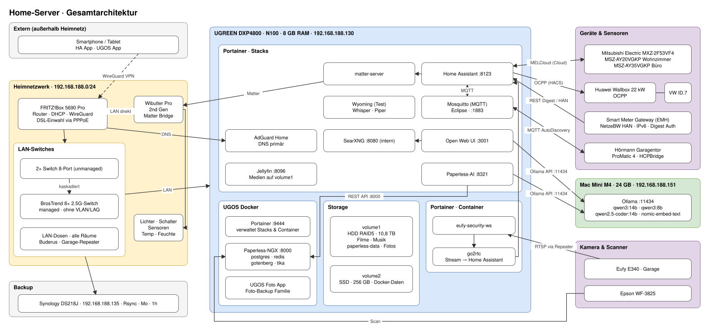

# Heimserver-Dokumentation

Zentrale Dokumentation meines Heimnetz- und Server-Setups.  
Ziel: Nachvollziehbarkeit, schnelle Fehlersuche und sicherer Wiederaufbau.

---

## Architektur-Übersicht



> Quelle: [Architecture/HomeServer.drawio.svg](Architecture/HomeServer.drawio.svg). Bearbeiten in VS Code mit der Extension **Draw.io Integration** (`hediet.vscode-drawio`).

---

## Quick Reference – Services

| Service | URL | Läuft auf | Verwaltet via |
|---|---|---|---|
| UGOS (NAS-UI) | https://192.168.188.130:9443 | UGREEN DXP4800 | UGOS |
| Portainer | https://192.168.188.130:9444 | UGREEN DXP4800 | UGOS Docker |
| Home Assistant | http://192.168.188.130:8123 | UGREEN DXP4800 | Portainer Stack |
| Paperless-NGX | http://192.168.188.130:8000 | UGREEN DXP4800 | UGOS Docker |
| AdGuard Home | http://192.168.188.130:8080 | UGREEN DXP4800 | Portainer Stack |
| Jellyfin | http://192.168.188.130:8096 | UGREEN DXP4800 | Portainer Stack |
| Open Web UI | http://192.168.188.130:3001 | UGREEN DXP4800 | Portainer Stack (ai-stack) |
| SearXNG | http://192.168.188.130:8080 (intern) | UGREEN DXP4800 | Portainer Stack (ai-stack) |
| Synology DSM | http://192.168.188.135:5000 | Synology DS218J | — |
| FritzBox | http://192.168.188.1 | FRITZ!Box 5690 Pro | — |

> Alle Services sind **ausschließlich im Heimnetz** erreichbar.  
> Remote-Zugriff erfolgt ausnahmslos über **WireGuard VPN** (konfiguriert auf der FritzBox).

---

## Quick Reference – Netzwerk

| Gerät | IP | IP-Vergabe |
|---|---|---|
| FRITZ!Box 5690 Pro | 192.168.188.1 | statisch (Router) |
| UGREEN DXP4800 | 192.168.188.130 | DHCP-Reservierung (FritzBox) |
| Mac Mini M4 | 192.168.188.151 | DHCP-Reservierung (FritzBox) |
| Synology DS218J | 192.168.188.135 | DHCP-Reservierung (FritzBox) |
| BrosTrend 8× 2.5G-Switch | noch nicht dokumentiert | managed Switch mit Web-UI |
| Wibutler Pro 2nd Gen | — | DHCP (direkt an FritzBox) |
| Smart Meter Gateway (EMH) | `2003:de:9f37:1c00:215:3bff:fee4:1f5c` | IPv6-only, kein DHCP/IPv4 |

---

## Quick Reference – Storage (UGREEN)

| Volume | Typ | Größe | Inhalt |
|---|---|---|---|
| volume1 | HDD RAID5 | 10,8 TB | Filme, Musik, Fotos, paperless-data |
| volume2 | SSD (kein RAID) | 256 GB | Docker-Containerdaten, Paperless-Stack |

Paperless-NGX Pfade:
- Container & consume: `/volume2/docker/paperless-ngx`
- Dokumentendaten: `/volume1/paperless-data`

---

## Dokumentationsstruktur

```
homeserver-docs/
├── README.md                           ← diese Datei
├── architecture/
│   ├── overview.md                     ← Architektur in Prosa
│   └── HomeServer.drawio.svg           ← Architektur-Diagramm (draw.io)
├── hardware/
│   ├── ugreen-dxp4800.md
│   ├── network.md
│   └── geraete.md
├── services/
│   ├── home-assistant.md
│   ├── paperless-ngx.md
│   ├── adguard-home.md
│   ├── portainer.md
│   ├── jellyfin.md
│   └── kameras.md
├── backup/
│   └── strategie.md
└── guides/
    ├── neuen-service-hinzufuegen.md
    └── wireguard-remote.md
```

---

## Wichtige Hinweise

- **Kein Cloud-Backup** – die Synology DS218J ist das einzige Backup-Ziel. Bei Totalausfall beider NAS gibt es keinen weiteren Restore-Pfad.
- **Wibutler ist Single Point of Failure** für alle Smarthome-Geräte. Fällt er aus, ist die Matter-Bridge unterbrochen und Home Assistant verliert die Kontrolle über Lichter und Sensoren.
- **Wyoming (Whisper + Piper)** läuft als Testumgebung ohne aktive HA-Integration.
- **Ollama** läuft aktiv auf dem Mac Mini M4 (192.168.188.151) – Modelle und Konfiguration: siehe [Hardware/mac-mini-m4.md](Hardware/mac-mini-m4.md).
